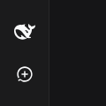

English | [简体中文](README.md)

# dsh-balance-monitor

DeepSeek balance and spend windows, right in the dsh sidebar footer.

A minimal [DeepSeek Harness](https://github.com/deepseek-ai/deepseek-harness) (dsh) plugin that shows the current session's channel balance/usage in the sidebar footer, styled with the stock design tokens. The **DeepSeek official channel** shows balance plus today / 7-day / 30-day spend windows (official usage data when a platform token is set); the **Volcano Ark channel** shows Agent Plan quota bars (5h / weekly / monthly); the **Command Code channel** shows 5h / weekly / monthly usage windows (GOAT / Pro / Max plans).

<p align="center">
  
  
</p>

## Features

| What | How |
|---|---|
| Live balance | Queries `GET https://api.deepseek.com/user/balance` through the host half, using the `DEEPSEEK_API_KEY` from `$DSH_HOME/.credentials.yaml` (env var wins) |
| Today / 7d / 30d spend (official) | With `DEEPSEEK_PLATFORM_TOKEN` set, the host queries the official usage API `platform.deepseek.com/api/v0/usage/cost` (the same data the platform console shows) and sums per-day windows: 7d = today minus 6 days, 30d = today minus 29 days (both inclusive). Accurate no matter where else the API key is used |
| Balance-delta fallback | Without the platform token (or when the official API fails), today falls back to a balance-drop ledger (only accumulating drops; refills never inflate or wash out spend); 7d/30d show `—` |
| Channel awareness | The card follows the current session's model provider: the DeepSeek official channel shows balance/spend; the Volcano Ark channel shows Agent Plan bars; the Command Code channel shows usage windows; other channels show a "channel not supported" placeholder; no session renders nothing |
| Volcano Ark Agent Plan | With AK/SK configured, calls the `GetAFPUsage` control-plane API (SigV4 signed) and shows 5h / weekly / monthly quota bars, colored by usage (green → amber → red) |
| Command Code usage | With `COMMANDCODE_API_KEY` configured, calls `api.commandcode.ai/alpha/billing/credits` etc. and shows 5h / weekly / monthly used % with reset countdowns |
| Placement | Registered on the official `sidebar.footer.action` slot — above Settings, no patch hacks |
| Collapsed rail | Shrinks to a 36px circle with a compact balance and a tooltip |
| Resilience | 60s polling + re-poll on tab visibility; on upstream failure the last known numbers stay visible (dimmed as stale) instead of an error flash |

## Install

Works from source directly — the browser bundle is a hand-written classic script with **no build step**, so a git install needs no prepare script:

```sh
dsh plugin --profile web add "github:alanzhao0128/dsh-balance-monitor#main"
```

or from npm (once published):

```sh
dsh plugin --profile web add dsh-balance-monitor
```

Then restart the Web UI (`dsh --profile web`). The widget appears at the bottom of the expanded sidebar, above Settings.

## Configuration

### Settings panel (recommended)

Open dsh settings (gear) → **Balance Monitor** to edit the card's behaviour; saving writes the `dsh-balance-monitor:` section of `~/.dsh/settings.yaml` and applies immediately (a few fields after restart):

| Group | Field | Default | Purpose |
|---|---|---|---|
| Display | `ui.showCard` | `true` | Turning this off hides all channel cards |
| Display | `ui.warnThreshold` | `30` | Bar turns amber at this used % |
| Display | `ui.dangerThreshold` | `70` | Bar turns red at this used % |
| Refresh | `ui.pollMs` | `60` s | Card refresh interval (the panel shows seconds; stored internally as ms) |
| Network | `network.cacheMs` | `40` s | Host quota cache; keep below the card refresh interval |
| Network | `network.timeoutMs` | `20` s | Upstream timeout (Volcano Ark / Command Code / DeepSeek official usage) |
| Credentials | `credentials.file` | `.credentials.yaml` | Credentials document filename (relative to `$DSH_HOME`) |

### Channel credentials

The settings panel's **「渠道凭证 / Channel credentials」 group** shows which credentials each channel needs for its balance/usage display, and whether they are read-only (already referenced by the DSH model configuration) or writable:

| Channel | Credential | Interaction |
|---|---|---|
| DeepSeek official | `DEEPSEEK_API_KEY` | read-only (referenced by DSH model config), shows ✅/⚠️ status |
| DeepSeek official | `DEEPSEEK_PLATFORM_TOKEN` | **writable** password box (needed for official spend; expires), with a three-part explainer: what it is / how to get it (platform.deepseek.com → F12 → Console → `JSON.parse(localStorage.getItem('userToken')).value`) / what it does |
| Volcano Ark | `ARK_ACCESS_KEY_ID` | **writable** password box (plugin-specific; dsh models use `HUOSHAN_API_KEY` — a different pair) |
| Volcano Ark | `ARK_SECRET_ACCESS_KEY` | **writable** password box |
| Volcano Ark | region | read-only, auto-follows the DSH model config (parsed from the huoshan provider's `baseURL`, e.g. `cn-beijing`) |
| Command Code | `COMMANDCODE_API_KEY` | read-only (referenced by DSH model config), shows ✅/⚠️ status |

Writable boxes save through the official `ctx.credentials.set()` into `$DSH_HOME/.credentials.yaml` (`refs:` section, locked + atomic write); the plugin never writes the file itself.

### Credentials

Credentials live in `$DSH_HOME/.credentials.yaml` (write them from the Web UI Models page, or edit the file directly; the plugin reads them through the official `ctx.credentials` service, env vars win):

| Credential | Required | Purpose |
|---|---|---|
| `DEEPSEEK_API_KEY` | ✅ | Balance lookup `api.deepseek.com/user/balance` |
| `DEEPSEEK_PLATFORM_TOKEN` | optional | Official usage (today/7d/30d). Get it: sign in at [platform.deepseek.com](https://platform.deepseek.com) → DevTools Console, run `JSON.parse(localStorage.getItem('userToken')).value`, store the output as the credential |

> ⚠️ `DEEPSEEK_PLATFORM_TOKEN` is a web-session token and **expires** (the official API returns code 40002/40003 when stale). On expiry the card shows a red hint and falls back to the balance-delta estimate; paste a fresh token in the settings panel credentials group to restore official usage. Balance lookup is unaffected.

| Credential | Required | Purpose |
|---|---|---|
| `ARK_ACCESS_KEY_ID` | Volcano Ark channel | Volcengine access key for the control-plane API (Agent Plan quota) |
| `ARK_SECRET_ACCESS_KEY` | Volcano Ark channel | Volcengine secret access key |
| `COMMANDCODE_API_KEY` | Command Code channel | Command Code API key (`user_...`) for the 5h / weekly / monthly usage query |

> Get Ark AK/SK: sign in at [console.volcengine.com](https://console.volcengine.com) → Access Control → API Access Keys → create a key. Note: AK/SK are IAM account-level credentials that can operate all resources — keep them private.

## How it works

One combined plugin row (`dsh.bundle` patch + `dsh.client` roster declaration):

- **Host half** (`lib/index.js`) — registers three RPC channels (loopback trust fence) on `ctx.connection`: `/balance` (DeepSeek balance + official usage windows + fallback ledger), `/ark-quota` (Volcano Ark Agent Plan quota, signed with AK/SK SigV4 against `GetAFPUsage`, cached for 40s — strictly below the browser's 60s poll so every poll triggers a fresh upstream fetch), and `/cmdcode-quota` (Command Code usage, Bearer `api.commandcode.ai/alpha/billing/credits` etc., cached for 40s). Cache and timeout durations come from the settings panel (`network.*`); credentials are read through the official `ctx.credentials` service.
- **Browser half** (`lib/client.js`) — a zero-dependency classic-script bundle registering a `sidebar.footer.action` entry. It tracks the current session's provider via `sessions.list` subscription plus a light 1s poll of `session.models` (a local RPC), then dispatches through the channel registry: `deepseek-official` renders the balance card (60s polling, re-poll on tab visibility); `huoshan` renders the Ark quota bars; `commandcode` renders the usage windows; unregistered channels render the unsupported placeholder; no session renders nothing. The `llm/adapters-updated` remote event triggers an immediate re-check. It also registers a `settings.section` page (Balance Monitor) reading/writing the `dsh-balance-monitor` namespace; a new `/credential-status` RPC (credential status + region) decides which refs are read-only via `ctx.llm`/`ctx.settings`.

State file (`$DSH_HOME/storages/balance-monitor.json`):

```json
{
  "date": "2026-08-17",
  "dayStart": 100.0,
  "lastTotal": 97.7,
  "lastCurrency": "CNY",
  "spent": 1.65,
  "spent7d": 5.24,
  "spent30d": 18.54,
  "spentSource": "official",
  "updatedAt": 1755400000000
}
```

`spentSource` is `official` (platform API) or `estimate` (balance-delta ledger).

## Security notes

- The API key, platform token, and Ark AK/SK never leave the host: the browser half only ever sees balance/spend/quota numbers over the RPC channel, never the credentials.
- The channel is served under the `loopback` trust authority.
- No telemetry, no network beyond the official balance, usage, and Ark quota endpoints.

## Layout

```
dsh-balance-monitor/
├── package.json        # dsh.bundle (patch) + dsh.client (browser roster)
├── cordis.patch.yml    # inserts the one combined plugin row
└── lib/
    ├── index.js        # host half: /balance + /ark-quota RPC channels + settings wiring
    ├── config.js       # settings schema + defaults (mirrored by the panel)
    ├── signature.js    # Volcengine OpenAPI SigV4 signing (AK/SK)
    └── client.js       # browser half: sidebar footer card + settings page (hand-written, no build)
```

## Development

No toolchain required. Edit `lib/*.js` directly; the bundle format mirrors what the official `tsdown` preset emits (`window.__ModuleLoader__.load({ id, factory })`).

## License

MIT
